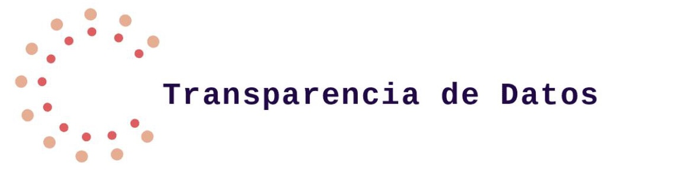
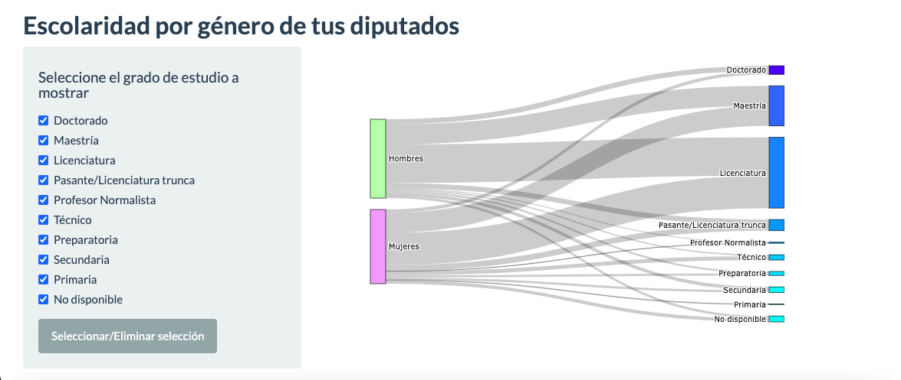
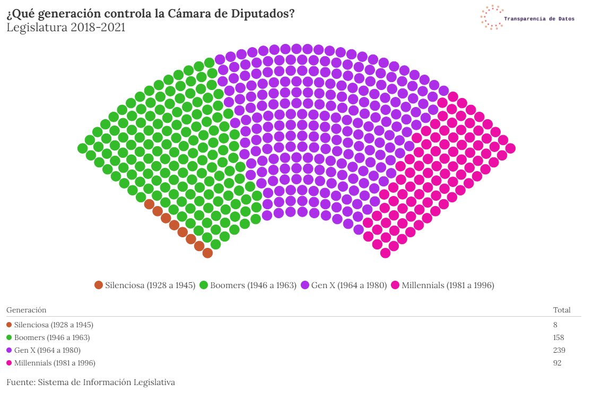
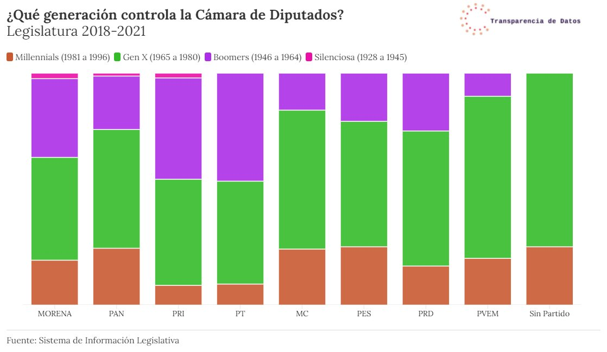

## Transparencia de Datos

Proyecto de los miembros del equipo de Transparencia de Datos de Datalab ITAM que tiene por objetivo transparentar y facilitar el acceso a información relevante sobre nuestros representantes.

Equipos de trabajo y objetivos:
- **Web scraping:** Hacer scraping para construir bases de datos útiles tanto para el resto de los equipos de Transparencia de Datos, como para la población en general.
- **Análisis y visualización de datos:** Hacer análisis y presentar visualizaciones relevantes a la población en general.
- **Dashboard:** Construir un dashboard interactivo que servirá de plataforma para publicar las visualizaciones, análisis y bases de datos trabajadas. 

Contenido:
- *ui.R*, *server.R*, *www* y *Dashboard-data* contienen los archivos necesarios para el Dashboard publicado en línea.
- Los directorios *Webscraping-x* y *Visualizaciones-x* contienen las bases de datos scrapeadas, información al respecto de las variables en las bases, y el código para replicar el proceso para cada tema *x*.
- *Sample-Images*, *ReadMe.md* y *.gitignore* son archivos propios del repositorio.

Para cualquier aporte, colaboración, comentario o petición, favor de contactar al equipo de Datalab ITAM (datalabitam@gmail.com).

Ejemplos del trabajo realizado:

